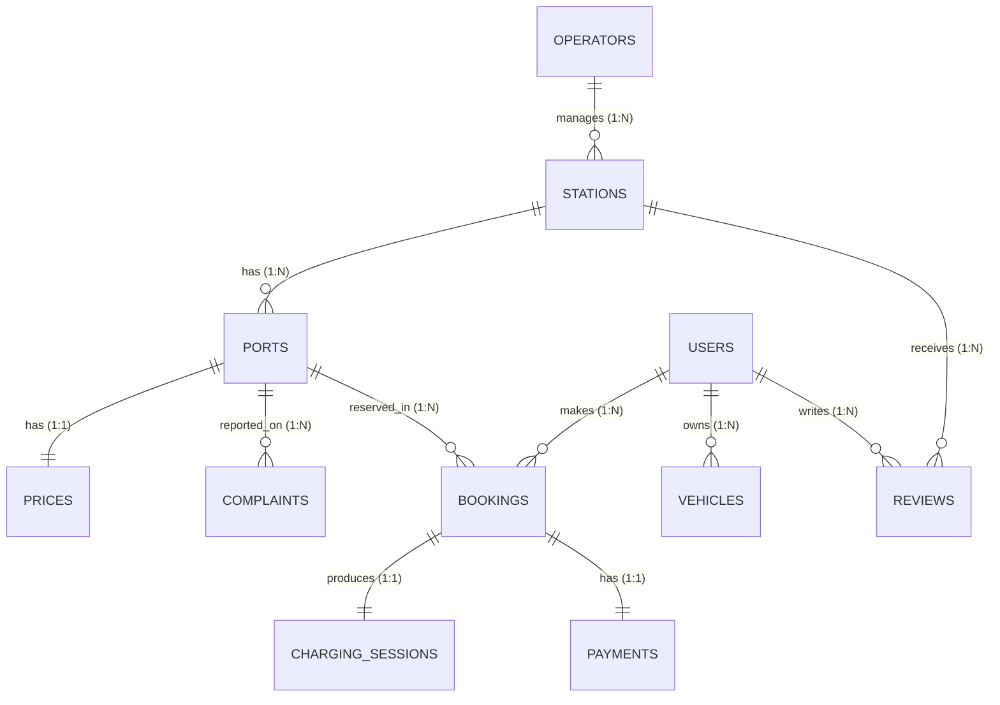

# Entity-Relationship (ER) Model Analysis

## 1. Overview
The conceptual model represents the operational domain of an Electric Vehicle (EV) Charging Network. The design consists of **11 entities** and their governing relationships.

---

## 2. Entity Specifications & Key Attributes

| Entity | Primary Key | Attributes | Description |
| :--- | :--- | :--- | :--- |
| **OPERATORS** | `operator_id` (PK) | `company_name` | Corporate entities owning charging infrastructure. |
| **STATIONS** | `station_id` (PK) | `operator_id` (FK), `latitude`, `longitude` | Physical geographic locations containing charging hardware. |
| **PORTS** | `port_id` (PK) | `station_id` (FK), `connector_type`, `status` | Individual charging plugs/guns attached to a station. |
| **PRICES** | `price_id` (PK) | `port_id` (FK), `rate_per_kwh` | Tariff pricing structure per kilowatt-hour for each port. |
| **USERS** | `user_id` (PK) | `name`, `phone` | EV drivers registered on the network. |
| **VEHICLES** | `vehicle_id` (PK) | `user_id` (FK), `type`, `connector_needed` | Registered EV assets owned by users. |
| **BOOKINGS** | `booking_id` (PK) | `user_id` (FK), `port_id` (FK), `start_time`, `status` | Reservation slots requested by users for charging. |
| **CHARGING_SESSIONS** | `session_id` (PK) | `booking_id` (FK), `energy_kwh`, `end_time` | Energy delivery event associated with a booking. |
| **PAYMENTS** | `payment_id` (PK) | `booking_id` (FK), `amount` | Financial transaction settling a completed booking. |
| **REVIEWS** | `review_id` (PK) | `user_id` (FK), `station_id` (FK), `rating` | Star ratings (1 to 5) submitted by users for stations. |
| **COMPLAINTS** | `complaint_id` (PK) | `port_id` (FK), `issue`, `status` | Incident tickets and maintenance defect reports. |

---

## 3. Relationships, Cardinalities & Participation Constraints

| Relationship | Entities Involved | Cardinality | Participation Constraints | Business Semantics |
| :--- | :--- | :--- | :--- | :--- |
| **Manages** | `OPERATORS` ── `STATIONS` | $1 : N$ | Total on `STATIONS`, Partial on `OPERATORS` | Every station must belong to exactly one operator. An operator can manage zero or multiple stations. |
| **Has (Ports)** | `STATIONS` ── `PORTS` | $1 : N$ | Total on `PORTS`, Total on `STATIONS` | A station contains multiple ports. Every port must belong to exactly one station. |
| **Has (Pricing)** | `PORTS` ── `PRICES` | $1 : 1$ (or $1:N$) | Total on `PRICES`, Total on `PORTS` | Every port has a defined electricity tariff rate. |
| **Owns** | `USERS` ── `VEHICLES` | $1 : N$ | Total on `VEHICLES`, Partial on `USERS` | A vehicle must belong to a user. A user may register zero or more vehicles. |
| **Makes** | `USERS` ── `BOOKINGS` | $1 : N$ | Total on `BOOKINGS`, Partial on `USERS` | A booking must be made by a registered user. A user can make multiple bookings over time. |
| **Reserved_In** | `PORTS` ── `BOOKINGS` | $1 : N$ | Total on `BOOKINGS`, Partial on `PORTS` | A booking is reserved for a specific port. A port can have multiple sequential bookings. |
| **Produces** | `BOOKINGS` ── `CHARGING_SESSIONS` | $1 : 1$ | Total on `CHARGING_SESSIONS`, Partial on `BOOKINGS` | A completed booking produces exactly one charging session. Cancelled bookings produce none. |
| **Has (Payment)** | `BOOKINGS` ── `PAYMENTS` | $1 : 1$ | Total on `PAYMENTS`, Partial on `BOOKINGS` | A completed booking is associated with a payment settlement. |
| **Writes** | `USERS` ── `REVIEWS` | $1 : N$ | Total on `REVIEWS`, Partial on `USERS` | A review is written by a user. |
| **Receives** | `STATIONS` ── `REVIEWS` | $1 : N$ | Total on `REVIEWS`, Partial on `STATIONS` | A review evaluates a station. |
| **Reported_On** | `PORTS` ── `COMPLAINTS` | $1 : N$ | Total on `COMPLAINTS`, Partial on `PORTS` | A complaint reports a defect on a specific port. |

---

## 4. Specialization & Domain Hierarchy
- **Connector Categorization**: Disjoint specialization into standard socket interfaces (`CCS2`, `Type 2`, `CHAdeMO`, `GB/T`, `Tesla Supercharger`).
- **Vehicle Classification**: Categorization into EV segments (`2-Wheeler`, `3-Wheeler`, `Sedan`, `SUV`, `Hatchback`, `Commercial Van`, `Bus`).
