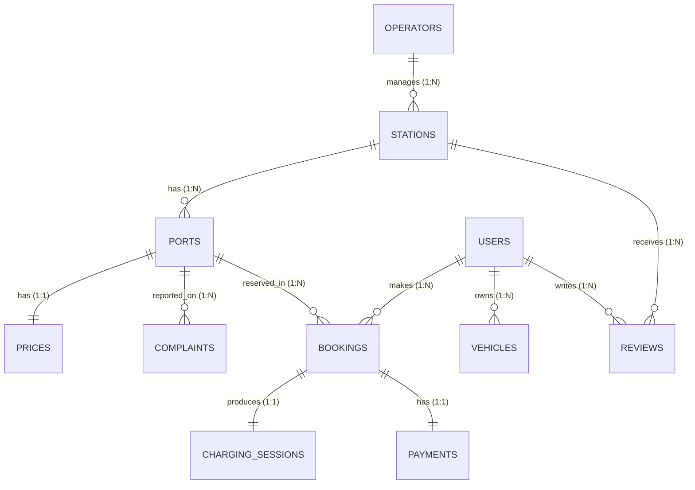

# Electric Vehicle (EV) Charging Station Network: Comprehensive DBMS Project Report

---

## 1. Executive Summary & Project Statement

### 1.1 Problem Statement
The global transition toward e-mobility has accelerated the need for intelligent, high-availability charging station networks. Managing EV charging infrastructure requires handling dynamic port statuses, driver bookings, real-time energy metering, variable tariff structures, digital billing, customer reviews, and hardware fault ticketing across multi-operator environments.

This Database Management System (DBMS) project delivers a normalized, high-integrity relational model that completely resolves operational complexities for EV charging infrastructure.

### 1.2 Key System Objectives
1. **Infrastructure Management**: Track operators, physical station locations (geospatial coordinates), and individual charging ports.
2. **Connector & Vehicle Compatibility**: Manage multi-standard connector interfaces (CCS2, Type 2, CHAdeMO, GB/T, Tesla Supercharger) matched to EV models.
3. **Transaction & Energy Metering**: Process atomic slot bookings, measure charging session energy ($kWh$), and compute billing amounts based on tariff rates.
4. **Maintenance & Incident Tracking**: Log customer complaints on ports, trigger status updates, and track maintenance lifecycles.
5. **Customer Satisfaction**: Aggregate driver star ratings to compute operator and station performance scores.

---

## 2. Conceptual Design: Entity-Relationship (ER) Model

### 2.1 Entity Relationship Diagram
The conceptual design consists of **11 entities** arranged as follows:

### 2.2 Cardinality & Participation Constraints

| Relationship | Cardinality | Participation | Semantic Rule |
| :--- | :--- | :--- | :--- |
| `OPERATORS` ── `STATIONS` | $1 : N$ | Total on `STATIONS`, Partial on `OPERATORS` | Every station is managed by 1 operator. |
| `STATIONS` ── `PORTS` | $1 : N$ | Total on `PORTS`, Total on `STATIONS` | Every port belongs to 1 station. |
| `PORTS` ── `PRICES` | $1 : 1$ | Total on `PRICES`, Total on `PORTS` | Every port has a defined tariff rate. |
| `USERS` ── `VEHICLES` | $1 : N$ | Total on `VEHICLES`, Partial on `USERS` | Every vehicle belongs to 1 user. |
| `USERS` ── `BOOKINGS` | $1 : N$ | Total on `BOOKINGS`, Partial on `USERS` | Every booking is made by 1 user. |
| `PORTS` ── `BOOKINGS` | $1 : N$ | Total on `BOOKINGS`, Partial on `PORTS` | A booking reserves a specific port. |
| `BOOKINGS` ── `CHARGING_SESSIONS` | $1 : 1$ | Total on `CHARGING_SESSIONS`, Partial on `BOOKINGS` | Completed booking produces 1 session. |
| `BOOKINGS` ── `PAYMENTS` | $1 : 1$ | Total on `PAYMENTS`, Partial on `BOOKINGS` | Completed booking has 1 payment. |
| `USERS` / `STATIONS` ── `REVIEWS` | $1 : N$ | Total on `REVIEWS`, Partial on `USERS`/`STATIONS` | Reviews evaluate stations. |
| `PORTS` ── `COMPLAINTS` | $1 : N$ | Total on `COMPLAINTS`, Partial on `PORTS` | Complaints report defects on ports. |

---

## 3. Relational Schema & Integrity Constraints

### 3.1 Schema Definitions
- $\text{OPERATORS}(\underline{\text{operator\_id}}, \text{company\_name})$
- $\text{STATIONS}(\underline{\text{station\_id}}, \text{operator\_id}^*, \text{latitude}, \text{longitude})$
- $\text{PORTS}(\underline{\text{port\_id}}, \text{station\_id}^*, \text{connector\_type}, \text{status})$
- $\text{PRICES}(\underline{\text{price\_id}}, \text{port\_id}^*, \text{rate\_per\_kwh})$
- $\text{USERS}(\underline{\text{user\_id}}, \text{name}, \text{phone})$
- $\text{VEHICLES}(\underline{\text{vehicle\_id}}, \text{user\_id}^*, \text{type}, \text{connector\_needed})$
- $\text{BOOKINGS}(\underline{\text{booking\_id}}, \text{user\_id}^*, \text{port\_id}^*, \text{start\_time}, \text{status})$
- $\text{CHARGING\_SESSIONS}(\underline{\text{session\_id}}, \text{booking\_id}^*, \text{energy\_kwh}, \text{end\_time})$
- $\text{PAYMENTS}(\underline{\text{payment\_id}}, \text{booking\_id}^*, \text{amount})$
- $\text{REVIEWS}(\underline{\text{review\_id}}, \text{user\_id}^*, \text{station\_id}^*, \text{rating})$
- $\text{COMPLAINTS}(\underline{\text{complaint\_id}}, \text{port\_id}^*, \text{issue}, \text{status})$

*(Note: $\underline{\text{Underlined}}$ indicates Primary Key, $^*$ indicates Foreign Key).*

---

## 4. Normalization Proof (1NF to 3NF / BCNF)

- **1NF**: Every column contains atomic values, no repeating groups exist.
- **2NF**: All relations have single-attribute primary keys, eliminating any possibility of partial key dependencies ($X \subset PK \implies X \not\rightarrow Y$).
- **3NF & BCNF**: For every functional dependency $X \rightarrow Y$, the determinant $X$ is a superkey or candidate key. No transitive dependencies exist.
- **Decomposition Properties**: Lossless join decomposition and functional dependency preservation are fully guaranteed.

---

## 5. SQL Implementation Summary

| Category | Scripts Provided | Description |
| :--- | :--- | :--- |
| **DDL** | `01_create_tables.sql`, `02_constraints_indexes.sql`, `01_ddl_demonstrations.sql` | Table creation, constraint enforcement, alter columns, rename tables, truncate, drop. |
| **DML** | `02_dml_demonstrations.sql`, `01_populate_data.sql` | Single/batch inserts, update with/without cascade, delete with/without cascade. |
| **DCL** | `03_dcl_demonstrations.sql` | Role-based security (`GRANT`, `REVOKE`) for Operator, Customer App, and Data Analyst. |
| **TCL** | `04_tcl_demonstrations.sql` | Atomic transaction workflows (`COMMIT`, `SAVEPOINT`, `ROLLBACK`). |
| **DQL** | `05_dql_basic_advanced.sql`, `06_joins_and_set_ops.sql`, `07_subqueries.sql` | Where, aggregate, like/in/distinct, order by, limit/offset, group by + having, all join types, set ops (union, intersect, except), subqueries. |
| **Views** | `08_views.sql` | `v_station_live_status`, `v_user_charging_history`, `v_operator_financial_summary`, materialized views. |
| **Procedures & Triggers** | `09_procedures_triggers.sql` | Port auto-reserve trigger, port auto-release trigger, fault auto-trigger, bill calculation function. |

---

## 6. Seed Dataset Metrics

The test database is populated with over **1,300+ referentially consistent rows**:
- **15** Operators
- **45** Stations across major global hubs
- **197** Charging Ports & Pricing Tiers
- **120** Registered EV Drivers
- **151** Registered Electric Vehicles
- **320** Booking Reservations
- **261** Completed Charging Sessions & Payments
- **174** Customer Reviews
- **60** Maintenance Complaints

---

## 7. Interactive Front-End Application

The system includes a **Python Streamlit dashboard** (`app/app.py`):
1. **Live Station Explorer**: Map visualization and real-time port status breakdown.
2. **Booking & Charging Simulator**: Interface to book ports, trigger active charging, and generate bills.
3. **Complaint & Review Hub**: Form to submit customer feedback and log port fault tickets.
4. **SQL Query Workbench**: Interactive query runner executing real-time SQL with instant tabular output and metrics.
